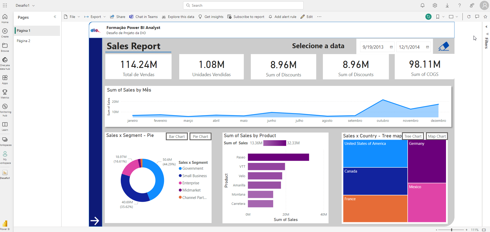
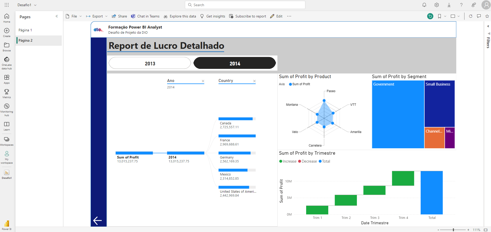

# Desafio 1 - Cria um relatório no Power BI usando a amostra de dados financeiros

O objetivo desse desafio é criar um relatório usando os dados disponíveis em [Amostra de dados financeiros](<data/Financial Sample.xlsx>) usando o Power BI. O relatório foi publicado no Power BI Services e possui as seguintes características:

## Página 1:

- Seletor de intervalo temporal;
- Cartões mostrando totais relevantes;
- Gráficos:
  - Área mostrando o total de vendas por mês;
  - Segmentado (bar ou pie) mostrando vendas por segmento;
  - Barras segmentado mostrado soma de vendas por produtos;
  - Mapa ou tree mostrando vendas por país.

## Página 2

- Seletor de ano;
- Gráficos:
  - Árvore hierárquica da soma de lucros;
  - Radar mostrando produto e soma de lucros;
  - Árvore mostrando soma de lucros por segmento;
  - Cascata mostrando soma de lucro por trimestre.

## Imagens do relatório

