# Desafio 2 - Cria uma database no Azure, inserir a amostra de dados e criar um relatório no Power BI

Os objetivos desse desafio são:

1.  Cria uma database no Azure e inserir a amostra de dados;
2.  Usar o Power BI para conectar na database, realizar o processo de transformação e carregamento. Criar um relatório no Power BI.

## Criação da database Azure

Deve-se cria uma instancia do Azure Database for MySQL usando o Flexible server. Esse serviço possui um limite de uso sem custos o que facilita testar as configurações. Como guia, pode-se usar a documentação disponivel em [Criar uma instância do Banco de Dados do Azure para MySQL – Servidor Flexível usando o portal do Azure](https://learn.microsoft.com/pt-br/azure/mysql/flexible-server/quickstart-create-server-portal). Depois do serviço criado devemos popular a database com dados. Isso é feito utilizando um script MySQL que cria as tabelas e restrições. O script encontra-se em [script_db](<Desafio de Projeto/script_db.sql>) e ele foi feito utilizando o script disponibilizado em [power_bi_analyst repository](https://github.com/julianazanelatto/power_bi_analyst) e [power-bi repository](https://github.com/talitachobits/power-bi/tree/main) (que notou uma inconsistência nos dados disponibilizados no desafio).

## Conectando a database Azure usando o MySQL Workbench

O aplicativo MySQL Workbench (disponível em [MySQL Workbench](https://www.mysql.com/products/workbench/)) permite conectar a servidores de MySQL usando uma interface gráfica. Para realizar essa conexão pode-se seguir o guia disponível em [Usar o MySQL Workbench com o Banco de Dados do Azure para MySQL - Servidor Flexível](https://learn.microsoft.com/pt-br/azure/mysql/flexible-server/connect-workbench). Depois de conectado podemos enviar o script para criar a database e popular ela com informações. O log de informações deve ficar similar à

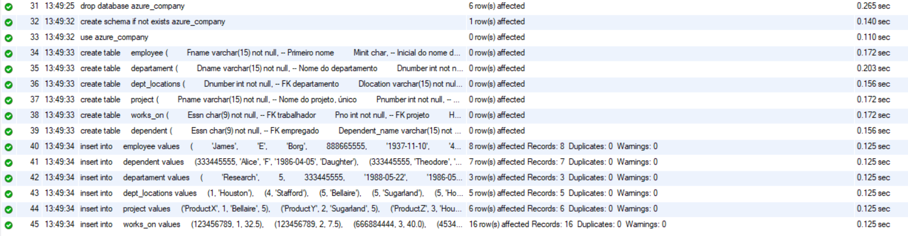

e depois de atualizarmos os schemas devemos ver as tabelas criadas

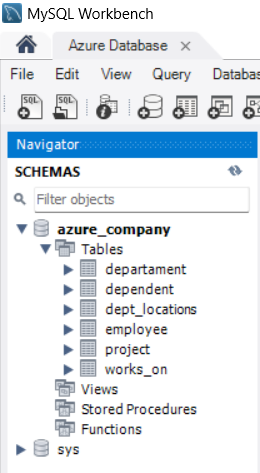

Podemos fazer uma consulta para verificar que tudo está de acordo.

```SQL
select * from employee;
select Ssn, count(Essn) from employee e, dependent d where (e.Ssn = d.Essn);
select * from dependent;
```

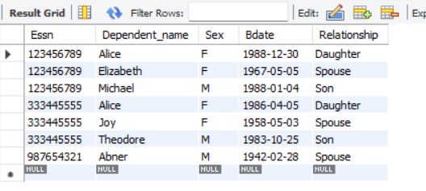

### Conectando ao Power BI, importando dados e criando relatório

Agora que temos a nossa database rodando e com dados podemos conectar à ela usando o Power BI. Podemos seguir os passos descritos no seguinte guia [Conectar-se ao Power BI Desktop a partir do portal do Azure](https://learn.microsoft.com/pt-br/azure/mysql/flexible-server/connect-with-powerbi-desktop). Feito isso devemos Transformar todos os dados.

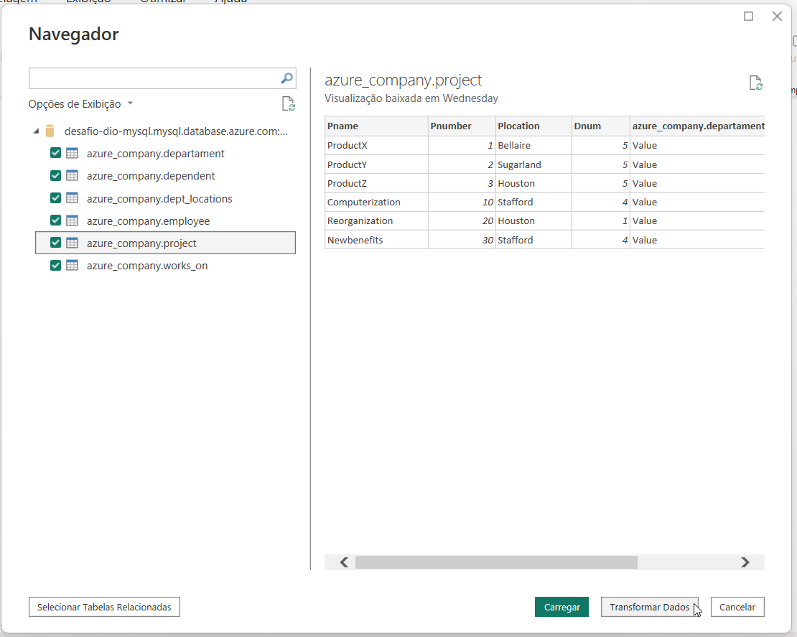

As verificações/transformações foram seguindo as indicações (que podem ser encontradas no final desse texto, em [Instruções](https://academiapme-my.sharepoint.com/:w:/r/personal/renato_dio_me/_layouts/15/Doc.aspx?sourcedoc=%7Beec4405c-91da-455e-a0dc-b798e93fdd0c%7D&action=view&wdAccPdf=0&wdparaid=50663017) ou em [power-bi repository](https://github.com/talitachobits/power-bi/tree/main)). O resultado de cada tabela é

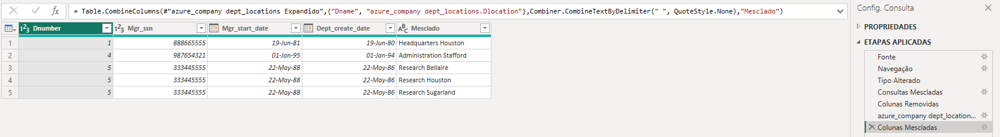
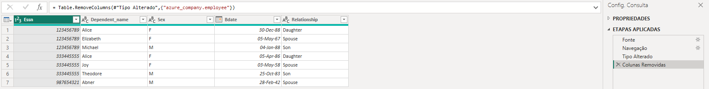
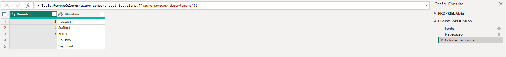
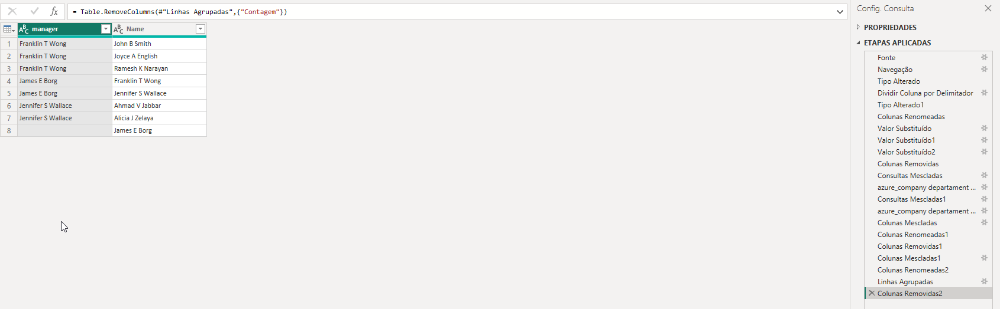
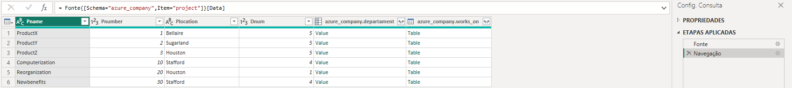
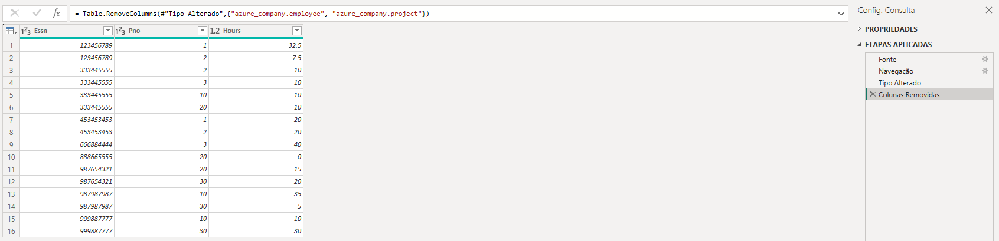

E o relatório simples ficou como

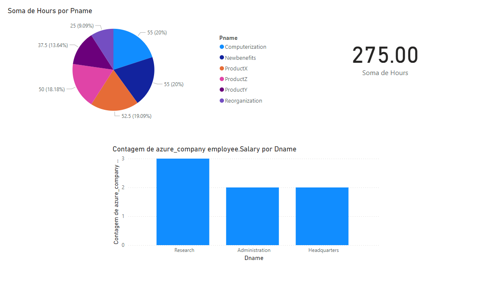

<details>
  <summary>Instruções do desafio</summary>
  Descrição do desafio módulo 3 – Processamento de Dados Simplificado com Power BI

1. Criação de uma instância na Azure para MySQL
2. Criar o Banco de dados com base disponível no github
3. Integração do Power BI com MySQL no Azure
4. Verificar problemas na base a fim de realizar a transformação dos dados

Diretrizes para transformação dos dados

1. Verifique os cabeçalhos e tipos de dados
2. Modifique os valores monetários para o tipo double preciso
3. Verifique a existência dos nulos e analise a remoção
4. Os employees com nulos em Super_ssn podem ser os gerentes. Verifique se há algum colaborador sem gerente
5. Verifique se há algum departamento sem gerente
6. Se houver departamento sem gerente, suponha que você possui os dados e preencha as lacunas
7. Verifique o número de horas dos projetos
8. Separar colunas complexas
9. Mesclar consultas employee e departament para criar uma tabela employee com o nome dos departamentos associados aos colaboradores. A mescla terá como base a tabela employee. Fique atento, essa informação influencia no tipo de junção
10. Neste processo elimine as colunas desnecessárias.
11. Realize a junção dos colaboradores e respectivos nomes dos gerentes . Isso pode ser feito com consulta SQL ou pela mescla de tabelas com Power BI. Caso utilize SQL, especifique no README a query utilizada no processo.
12. Mescle as colunas de Nome e Sobrenome para ter apenas uma coluna definindo os nomes dos colaboradores
13. Mescle os nomes de departamentos e localização. Isso fará que cada combinação departamento-local seja único. Isso irá auxiliar na criação do modelo estrela em um módulo futuro.
14. Explique por que, neste caso supracitado, podemos apenas utilizar o mesclar e não o atribuir.
15. Agrupe os dados a fim de saber quantos colaboradores existem por gerente
16. Elimine as colunas desnecessárias, que não serão usadas no relatório, de cada tabela
</details>
